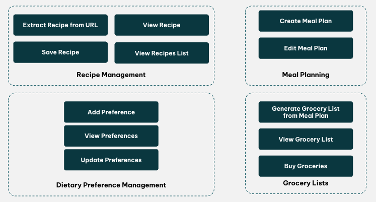

# Meal Planner Agent - Build Tasks

## Part 1: Setup The Foundations Of Your Agent ✅

### 🎯 TASK
Setup the foundations of your agent with basic tools and prompts.

### Steps

**1: SETUP:** Clone and set up our shared repository locally (see README.md)

**2: INSPECT:** Take some time using LangSmith to understand the ReAct loop which the agent uses to call the current mathematical tool that it has access to

**3: DESIGN:** Break your use-case down into possible "actions" that your agent might have to perform in order to achieve its goal(s)

You can use the following diagram as a guide:

**4: IMPLEMENT:** Replace the mathematical tools with a few tools that enable the above "actions" (NB: hard-code the tool implementations and responses, do not worry about this yet)

**5: EXPERIMENT:** Request some tasks to be completed by your agent and use LangSmith to inspect how it is executed. Try to break it by giving it complex cases

**6: IMPROVE:** Improve your agent's system prompt so that it behaves more accurately and according to your preferred style

---

## Part 2: Implement & Refine Your Tools ✅

### 🎯 TASK
Implement production-quality tools for one sub-domain using best practices for tool design and error handling.

### Steps

**1: GO NARROW:** Choose 1 sub-domain to focus on finishing first (*TIP: take recipe management or dietary preferences first)

**2: DO IMPLEMENTATIONS:** Do the tool implementations for that sub-domain (*HACK: write to a local file with k-v dict for persistence)

**3: ENSURE BEST PRACTICES:**
- Choosing the right tools for agents
- Naming and namespacing your tools
- Return meaningful context from your tools
- Optimizing tool responses for token efficiency
- Prompt-engineering your tool descriptions
- Use few-shot in system prompt
- Handle tool-call errors

---

## Part 3: Add Memory Capabilities ✅

### 🎯 TASK
Implement proper memory management using AgentState for persistence and conversation thread summarization.

### Steps

**1: IMPLEMENT SHORT-TERM MEMORY:**
- Add `MemorySaver` checkpointer from `langgraph.checkpoint.memory`
- Configure the agent to use the checkpointer for state persistence
- This enables the agent to maintain conversation history within a session

**2: USE THREAD STATE FOR PERSISTENCE:**
- Move all mocked data storage implementations to instead leverage AgentState for persistence
- Implement custom `MealPlannerState` schema with recipes and preferences
- Tools can now access and modify state directly through the runtime

**3: MANAGE CONVERSATION THREAD:**
- Implement summarization middleware to keep the messages thread's context size in check
- Automatically summarize old messages when token count exceeds threshold (e.g., 10,000 tokens)
- Keep recent messages (e.g., last 20) while summarizing older context

**4: MEMORY FEATURES:**
- Short-term memory: Conversation state persisted in memory using MemorySaver
- State-based persistence: Recipes and preferences stored in AgentState
- Context management: Automatic summarization to prevent token overflow
- Supports thread-based conversations (each thread_id maintains separate state)

---

## Part 4: Convert to a Multi-Agent Architecture ⏳

### 🎯 TASK
TBD

### Steps
TBD

---

## Notes

- All tools should use mocked responses for demo purposes
- Focus on Part 1 completion before moving to subsequent parts
- Use LangSmith to monitor and debug agent behavior

